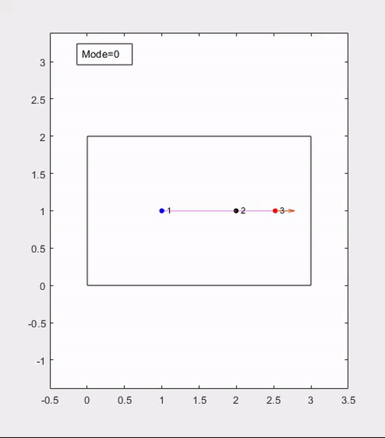

# Inchbots

Project by Andrew Glick and Nathan Hampton for Multi-Agent Robotics Systems at
the University of Texas at Dallas in Fall 2022.

## Objective

How do we control a group of physically linked robots that can only move in
their environment by pushing off each other?

## Examples

|  |  |
|:---------------------:|:-------------------------------------------:|
| Three nodes in a line | Five nodes with Δ-Disk proximity-based edges|

## Getting Started

1. Clone or download the folder on your local machine, and open it in Matlab
2. Run `init.m` as a standalone script to add all the necessary folders to your
   path (if running the Robotarium scripts).
3. Run any of the other Matlab scripts.

## Scripts

- `simple_*_nodes.m`: Andrew's simulations with regular plotting
- `robotarium_*_nodes.m`: Andrew's simulations with Robotarium
- `Inchworm_Controller*_Robotarium.m`: Nathan's simulations with Robotarium
- `Inchworm_Controller*_Sim.m`: Nathan's simulations with regular plotting
